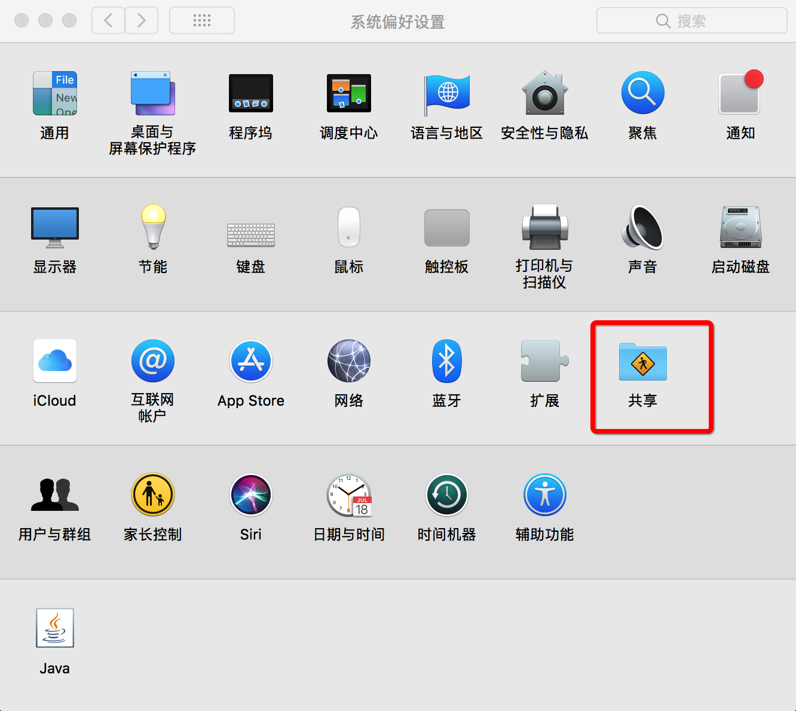
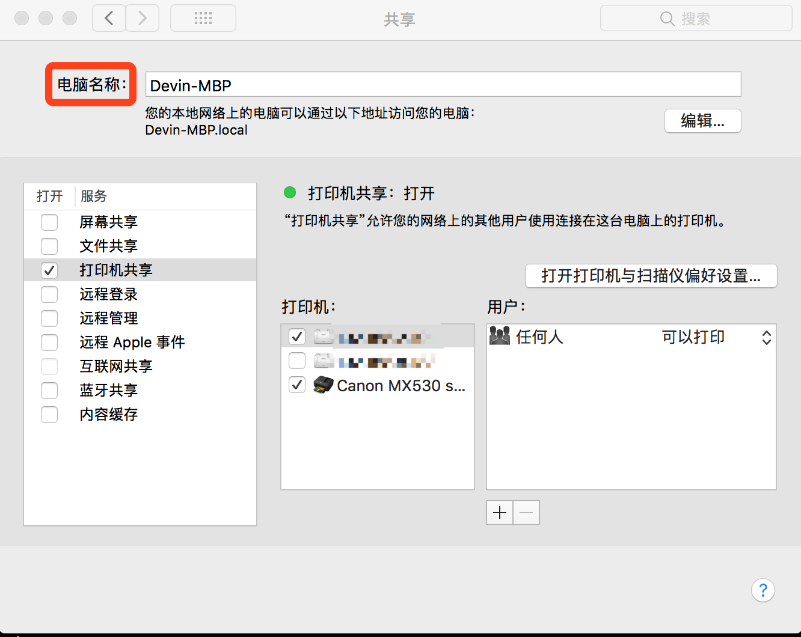

# Mac的主机名为bogon原因和解决办法

[TOC]

## 原因:

　　在使用IntelliJIDEA和terminal工具时,主机名显示为bogon(虚拟).这是因为终端会首先向DNS查询本机IP对应的主机名,查询不到才会显示我们自己设置的主机名,而由于我们配置或默认的DNS错误地将保留地址反向的NS查询结果返回了bogon. 其中bogon本应该用来指虚假的IP地址,而非保留IP地址.因此就出现了会时不时地打印bogon这种奇怪名字作为计算机名的现象了.

## 解决:

　　让终端直接显示我们的主机名而不是从DNS查询即可显示正确的主机名,请替换`你的主机名`为你想要设置的主机名,使用英文字母不要带空格例如:`Devin-MBP`.

```shell
$ sudo hostname 你的主机名
$ sudo scutil --set LocalHostName 你的主机名
$ sudo scutil --set HostName 你的主机名
```

## 补充一点:

　　设置电脑名称,别人可以在局域网看到此电脑名称,`设置`==>`共享`==>`电脑名称`==>输入即可,也可以使用下面的命令行修改.

```shell
$ sudo scutil --set ComputerName 你的主机名		#设置电脑名称,别人在网络共享上可以看到这个名字
```






test

test